# Developer Guide

## Table of Contents 
* [Acknowledgements](#acknowledgements)
* [Product Scope](#product-scope)
  * [Target User Profile](#target-user-profile)
  * [Value Proposition](#value-proposition)
* [User Stories](#user-stories)
* [Design & Implementation](#design--implementation)
  * [Main Menu component](#main-menu)
  * [Study Manager component](#study-manager-component)
  * [Expense Tracker component](#expense-tracker-component)
  * [Contacts Manager component](#contacts-manager-component)
  * [Load and Store](#load-and-store)
* [Non-Functional Requirements](#non-functional-requirements)
* [Glossary](#glossary)
* [Instructions for Manual Testing](#instructions-for-manual-testing)
  * [Study Manager](#study-manager)
  * [Expense Tracker](#expense-tracker)
  * [Contacts Manager](#contacts-manager)

## Acknowledgements
In this project, we have referenced the following list of materials:

* [AB-3 Developer Guide](https://se-education.org/addressbook-level3/DeveloperGuide.html)
* [PlantUML Tutorial at se-edu/guides](https://se-education.org/guides/tutorials/plantUml.html)
* [NUSMods](https://nusmods.com/)
* [Our individual projects](AboutUs.md)

We have used the following third-party libraries:
* [ical4j](https://www.ical4j.org/getting-started/)
  - Version 3.1.3
  - To read .ics files for easy addition to the module list.
* [SLF4j NOP](https://www.slf4j.org/)
  - Version 1.7.25
  - To remove runtime logging warning messages that result from using ical4j.

## Product scope
### Target user profile
* NUS undergraduate students
* has a need to manage their academic schedule 
* has a need to manage their expenses as a student
* has a need to manage a significant number of contacts
* prefer desktop apps over other types
* can type fast
* prefers typing to mouse interactions
* is reasonably comfortable using CLI apps

### Value proposition

This product helps NUS students who are struggling to keep track of their classes, 
expenses and networking centrally. It is a standalone product that works solely 
on data provided by the user. It also allows for parsing `.ics` files downloaded from NUSMods.

It solves the basic needs of a student such as managing academic schedule, expenses and contacts 
faster than a typical mouse driven or GUI driven apps.

## User Stories

|Version| As a ... | I want to ... | So that I can ...|
|--------|----------|---------------|------------------|
|v1.0|new user|see usage instructions|refer to them when I forget how to use the application|
|v1.0| user|add a new module|refer when I am not sure what is on my schedule right now|
|v1.0| user|list all modules|get a list of all my modules in one place|
|v1.0| user|delete a module|remove modules or tasks that I am done with|
|v1.0| user|add a new expense|keep track of my expenditure|
|v1.0| user|list all expenses|get a list of all my expenses in one place|
|v1.0| user|delete an expense|remove expenses that I do not need to track|
|v1.0| user|add a new contact|keep track of my contacts|
|v1.0| user|list all contacts|get a list of all my contacts in one place|
|v1.0| user|delete a contacts|remove contacts that I do not need to track|
|v2.0|user|find a module by name|locate a module without having to go through the entire list|
|v2.0|user|edit a module|change details for my existing modules to ensure consistency|
|v2.0|user|find an expense|locate an expense without having to go through the entire list|
|v2.0|user|edit an expense |change details for my existing expenses |
|v2.0|user|find a contact|locate a contact without having to go through the entire list|
|v2.0|user|edit a contact|change details for my existing contacts|
|v2.0|user|parse modules from NUSMods|easily add all my modules with a single command|
|v2.0|user|save and load entries from a session|reload my entries from the previous session|

## Non-Functional Requirements
1. Application should work on any mainstream operating system that has **Java 11** or above
2. Application should work ideally for users who type fast, yet no need for users to have prior
programming background
3. Application should be able to perform load and store operations on any mainstream operating
system without difficulty.

## Design & Implementation

### Main Menu
This section describes the implementation of core main menu features.

**API:** `AllOnUs.java`

The menu is accessed through a call to static method `main()` of the AllOnUs class. 
The Class Diagram below shows the overall structure of the application from the menu's point of view.
The `AllOnUs` class and other classes that are coupled to the menu are therefore included.

Note: Exception classes are left out of this diagram that aims to show the core structure of the application. `is*Command()`
and `is*Mode()` methods here refers to all methods of these forms (more on this will be elaborated later in detail). 

As illustrated in the Class Diagram above, the `AllOnUs` class only associates to one of each of the other classes.
These classes are, namely:
* `ContactsManager` class which manages the contacts section of the application
* `StudyManager` class which manages the module and timetable part of the application
* `ExpenseTracker` class which manages the expenses section of the application
* `StorageFile` class which manages the loading and storing of application related data
* `Logger` class which helps with logging information about the state of the programme when it is running
* `TextUi` class which handles user input from command line.

Now we will look at the sequence of operations that take place upon a call to method `main()` of the `AllOnUs` class. 
Below is a sequence diagram that shows the core interactions between associated classes and objects in the execution 
and runtime of the programme.

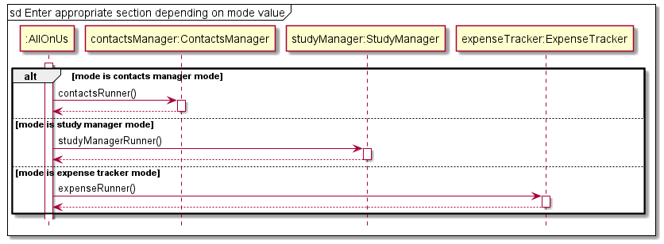

As illustrated in the diagram, once `main()` method of AllOnUs is called, a new unnamed `:AllOnUs` object is created 
for which we execute the non-static method `run()`, which contains a loop for sustained interaction with the user
(command line). Objects for the `ContactsManager` (`contactsManager`), `StudyManager` (`studyManager`), 
`ExpenseTracker` (`expenseTracker`), `StorageFile` (`storageFile`) and `TextUi` (`ui`) classes are also created, 
where `Logger` (`logger`) object is already contained in the relevant field of the `:AllOnUs` object. 

Once the `run()` method is called, the program enters a loop with the following sequence:
1) `is*Mode()` method is called with parameter `mode` of enumeration `Mode`. If `mode` has value not corresponding to 
menu mode, step 2 executes. Else, step 3 executes.
2) either of `expenseRunner()` (belongs to `expenseTracker`), `studyManagerRunner()` (belongs to `studyManager`) or 
`contactsRunner()` (belongs to `contactsManager`) methods is called depending on `mode` value. 
3) `getUserInput()` method is called, which belongs to object `ui`, and then checks the returned string for 
whether it is a command to enter a particular section (essentially step 2), to get help, to exit the application or 
is an empty or unrecognizable command. 

**Steps 1 and 2**:

`mode` can only take 4 possible values which are reflected in the class diagram above in the `Mode` enumeration. 
* `mode = MENU` signifies that the program is currently in menu mode and should execute normally (i.e. step 3 above).
* `mode = CONTACTS_MANAGER` signifies that menu interaction with the user should not occur and control should be given 
to `contactsManager` object (call to runner method of this object).
* `mode = STUDY_MANAGER` signifies that menu interaction with the user should not occur and control should be given to 
`studyManager` object.
* `mode = EXPENSE_TRACKER` signifies that menu interaction with the user should not occur and control should be given 
to `expenseTracker` object.

`mode` is updated upon every return from a method call to any of the manager/tracker objects. This allows for user to indicate 
whether they actually want to return to the menu (`mode` is set to `MENU` when user enters `menu` command in any of the other sections)
or want to enter another section of the application (`mode` is set to any other value of `mode` when user enters a valid `goto` command
in any of the other sections) from the section they entered the command from. The `mode` value is checked by calls to methods of 
the form `is*Mode()` which are `isContactsManagerMode()`, `isStudyManagerMode()` and `isExpenseTrackerMode()`. 

For example, if user is currently in expense tracker (runner method of `expenseTracker` is executing) and user wants 
to return to menu, the return value of the runner method will update `mode` to `MENU` for the next iteration in the 
menu (step 3 executes). If the user, say, wants to jump to the study manager, the return value of the runner method 
will update `mode` to `STUDY_MANAGER` and control will switch to the study manager (runner method of `studyManager` 
is called), which is essentially step 2.

**Step 3**:

Once the user enters a command, `getUserInput()` returns a string `userInput` which becomes a parameter for a function 
call to static method `is*Command()`, which belongs to the `AllOnUs` class, and the `is*Command()` method is of the 
form `isStudyManagerCommand()`, `isContactsManagerCommand()` and `isExpenseTrackerCommand()`, `isHelpCommand()`, 
`isExitCommand()` and `isEmptyCommand()` which are called in a certain sequence. These methods return boolean values 
which indicate whether `userInput` is a command concerning either of the following actions. 

* Command to enter a particular section: 
  * Either `isContactsManagerCommand()`, `isStudyManagerCommand()` or `isExpenseTrackerCommand()` returns `true` 
  (called in that order) and execution depending on which method returns `true`, the runner method of the respective 
  object is called (control switches to one of the managers/tracker).
  * After the runner method is done executing, the updated `mode` value is returned to the `run()` method of `:AllOnUs object`. 

* Command for help section:
  * If the `isHelpCommand()` method returns `true` on `userInput`, the `displayHelp()` method is called
  which displays the help section to the user and then returns to the `run()` method.

* Empty or unrecognized command:
  * When `userInput` is empty (`isEmptyCommand()` returns `true`), execution continues to the next iteration of the loop. 
  This is essentially similar to a "pass" statement as when the user does not input anything, the application silently 
  waits for the user to input something into the command line. 
  * When there is an unrecognized command (returns `false` on all the methods of type `is*Command()`), the application 
  prompts the user through a function call to a static method `printInvalidMainMenuCommandMessage()` (belongs to 
  `AllOnUs` class and not included in the diagrams above) to enter a known command and suggests referring to the help section.

* Exit command:
  * If the `isExitCommand()` method returns `true` on `userInput`, the loop breaks, and control is returned to the static `main()`
  method of the `AllOnUs` class, which then calls the static `exit` method in the same class to print a termination message, and then finally control
  is returned to the OS. 

### Modules

#### Study Manager component
API: `StudyManager.java`

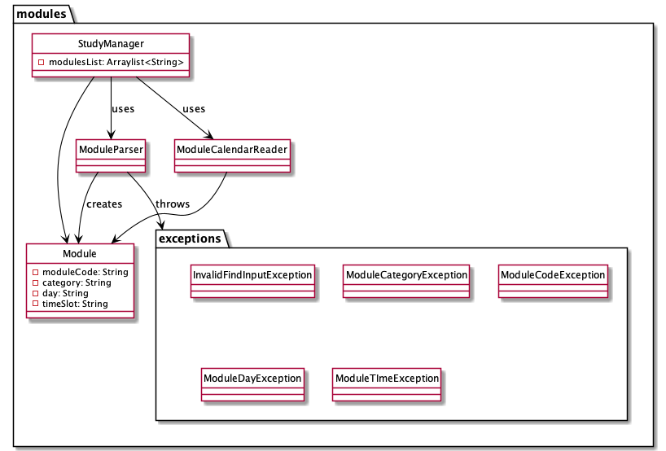

The `StudyManager` component,
1. Stores the academic schedule, i.e. all `Module` objects are contained in a `modulesList` object.
2. Integrates `ModuleParser.java`, `ModuleCalendarReader.java`, `Module.java` and package `exceptions` with the rest of the application. 
3. The storage is bound to `modulesList` list such that everytime a change is observed in the list it is saved on to a file.
4. Does not depend on other components like `ExpenseTracker` and `ContactsManager`.

How `StudyManager` works:
1. Based on a command entered by the user, StudyManager can perform the following functions 
   * `add` 
   * `list` 
   * `delete` 
   * `edit` 
   * `find` 
   * `read ics`
   

2. The `StudyManager` class makes use of the `ModuleParser` class to validate user inputs and `Module` parameters. 
   * If there are any errors in the entry of `Module` parameters they are handled by
       the various exceptions in the `exceptions` package.
   

3. There are two ways to add to the `moduleList` to keep track of academic schedule 
   * Either the user can choose to add the modules one by one. (See user guide for add feature)
   * Or the user can choose to read from NUSMods .ics calendar file of their academic schedule. 
     (See user guide for `read ics` feature)
     * This is more convenient as it can add multiple modules at a single go. 
     * This feature makes use of the `ModuleCalendarReader.java` API.

   
The two ways to add modules are illustrated in the sequence diagram below:

### ModuleCalendarReader Component
API: `ModuleCalendarReader.java`

Makes use of external library [ical4j](https://www.ical4j.org/getting-started/) to parse calendar files of .ics type 
from [NUSmods](https://nusmods.com/). 

1. The necessary details like module code, module class time, module category and module day are taken from this file 
and parsed. 
2. The timezones are originally in UTC which are converted to Singapore timezone. 
3. The data is represented in a format that is used throughout the application for module paramters.  
4. They are then loaded into a `ArrayList<Module>` and returned for use in `StudyManager.java`.

### ModuleParser Component
API: `ModuleParser.java`

1. Used to parse user inputs and to validate input module parameters for add and edit functions, as well as to validate search
query for find functions.
2. Throws exceptions in package `exceptions` if there are any invalid inputs.

### [Proposed] Graduation Tracker Feature

Every semester the user can add the modules they have taken so far. This becomes easier with the `read ics` feature. 
This can then be used and compiled to form the graduation requirements check list.

More parameters could be added to the `Module` class like `moduleCredits` and `moduleClassification`
which would signify a module's credits and classification into UEM, GE, core and TE breadth or TE Depth.

A new class called `GradManager` could be created. A new `ArrayList<Module>` called `graduationList` could be created,
such that the user can add their modules to it once every semester. This list could show important details that could 
be set by the user such as total number of credits needed amd the number of credits in each `moduleClassification`.
Based on the `moduleCredits` and `moduleClassification` the number of credits in each module classification can easily be calculated. 

This list can then be used to track the user's graduation requirements and as a checklist to plan their remaining modules.

The suggested architecture has been detailed in a class diagram depicted below:

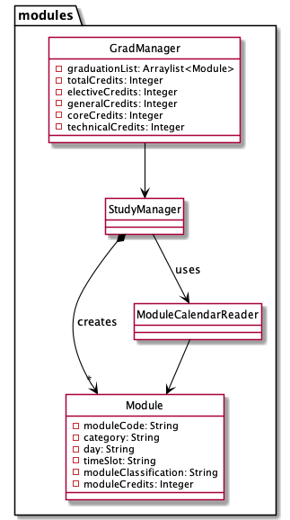

### [Proposed] Module Task Management Feature

Each module at NUS usually has a set of deliverables like assignments, exam dates, projects. This could be integrated 
into a task manager (similar to Duke) such that each module has a task list where the user can add any tasks that they 
would associate with that particular module. 
The architecture of the `taskList` has been detailed in a class diagram depicted below:

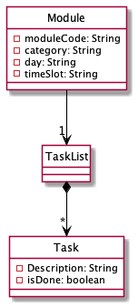

`StudyManager` can offer functions to view the combined task list for all modules or to just view for a specific module.

A sample implementation has been demonstrated in the sequence diagram depicted below.

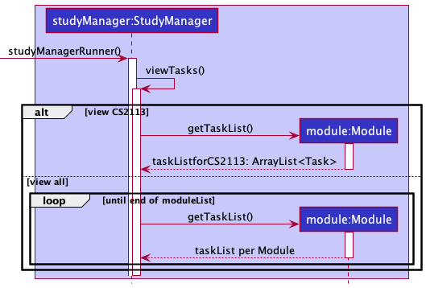

### Expense Tracker Component
API:[`ExpenseTracker.java`](https://github.com/AY2122S2-CS2113-F10-4/tp/blob/master/src/main/java/seedu/allonus/expense/ExpenseTracker.java)

The `ExpenseTracker` component consists of the ExpenseTracker class, ExpenseParser class and multiple
custom Exception classes.

The `ExpenseTracker` class provides the main runner for the `Expense` module of AlloNUS. `expenserunner()` reads 
in user commands and interacts with the `ExpenseParser` class depending on what the user has typed in. The 
`ExpenseParser` class either returns with the parsed result or with a custom exception, in which the 
`ExpenseTracker` class continues validating the inputs of the user before executing the user's commands.

How the Expense Tracker component is used:
1. From the Main Menu, if the user decides to run `goto Expense_Tracker`, the `ExpenseTracker` class takes over.
2. The `expenseRunner()` method begins by taking in user inputs depending on the user's requirements. Some examples
of valid commands include add, delete, list, edit and find.
3. Depending on the user's input, the `ExpenseParser` class calls 
`parseXYZExpense` where `XYZ` is a placeholder for the specific command name (eg. `parseDeleteExpense`).
4. If the parsing is valid (i.e. user followed the format of the command properly), the appropriate field values
are returned to the `ExpenseTracker` class.
5. The `ExpenseTracker` class takes these fields and validates them depending on the type of command entered by the user
in Step 2. (eg. if an `add` command is issued, the `ExpenseTracker` class checks if the Date is formatted properly)
6. After validating all checks, the command is executed accordingly within the `ExpenseTracker` class.

The Sequence Diagram below illustrates how the ExpenseTracker class operates if the user decides to add a new expense
record:

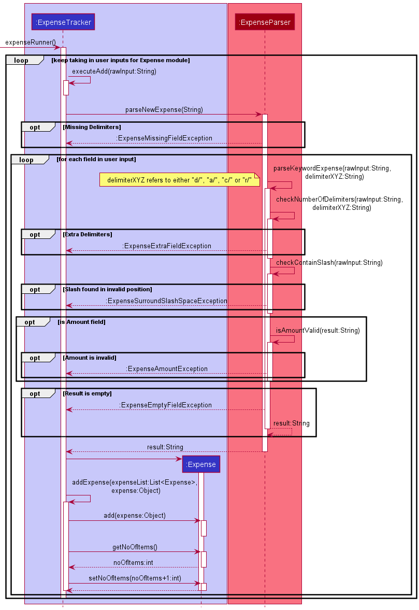

### [Proposed] Budgeting Reminder Feature

The proposed budgeting reminder feature is facilitated by `ExpenseTracker` and `Expense` class, which adds a 
private variable kept within the `Expense` class called `budget`. Additionally, it implements the following
operations:
- `Expense#setBudget(int)` --- Sets the current budget
- `Expense#getBudget()` --- Get the current budget left
- `ExpenseTracker#enable(int)` --- Turns on the budgeting mode which restricts exceeding of budget when adding new
expense records. It also sets the budget specified by the user.

Users may choose to enable the `Budgeting` feature via the command `enable` followed by the amount of budget
allocated in total. E.g `enable 3000`.

Whenever a new Expense record is added, the `addExpense` method of the `ExpenseTracker` class will check against
the current available `budget` and whether the expense record will cause the budget amount to be exceeded. If it 
exceeds, the addition of the new expense record will be rejected.

If the `enable` feature is turned on with existing records in the list, the `enable` method will run through the 
current list of expense records and deduct from the budget accordingly. If it already exceeds the budget, the user
will be forced to delete records until the budget is kept, or increase the budget accordingly.

Given below is an example usage scenario on how the Budgeting Reminder Feature works:

Step 1: The user navigates to the Expense Tracker for the first time, and decides to set a budget of $300.

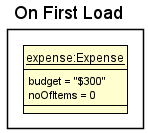

Step 2: The user proceeds to add 2 expense records, each with an amount of $100.

Step 3: The user now tries to add 1 more expense record with an amount of $200. This exceeds the budget and hence the 
addition will not be processed.

The following sequence diagram shows how the budget is checked upon every new addition of expense records:

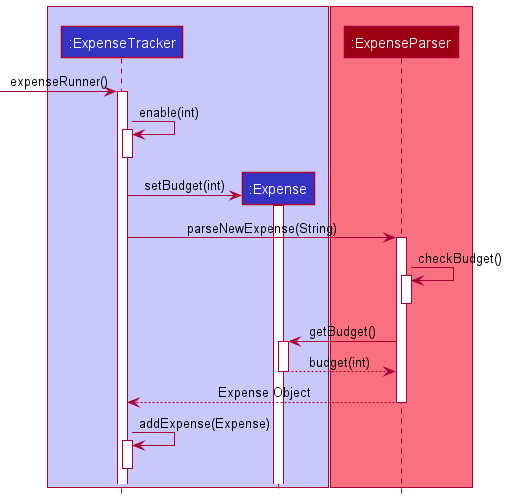

### Contacts

#### Contacts Manager Component

This section describes the design and implementation of Contacts Manager features.

**API:** `ContactsManager.java`

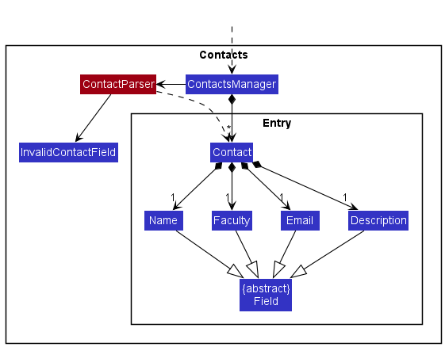

The `ContactsManager` component:
* stores the Contacts Manager data, i.e. all `Contact` objects are
contained in the contacts list, stored as a private class variable 
within a `ContactsManager` instance.
* each `Contact` object has four fields, `Name`, `Faculty`, `Email`,
and `Description`. These four classes inherit from the abstract class `Field`.
* calls methods in the `ContactParser` class to parse user inputs and
make the relevant edits to the contacts list
* when invalid inputs are supplied and parsed, the `ContactParser` class throws
an `InvalidContactField` exception

#### Contact Parser Component
**API:** `ContactParser.java`

The Sequence Diagram below illustrates interactions between classes of objects
for the static `setContactFields(contact, fieldStrings)` API call.

This API call is used both for adding a new contact, and for 
editing existing contacts. When adding a new contact, an empty `Contact` object
is supplied as an argument to `setContactFields()`, along with any strings of 
fields found in the user input.

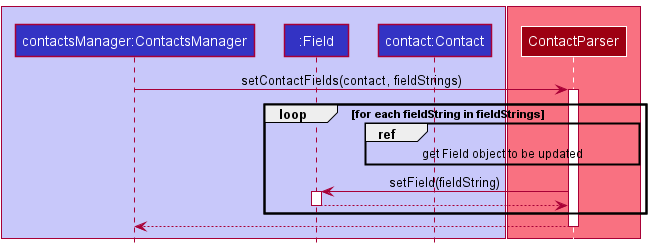

For each string in the array `fieldStrings`, the method identifies
which contact field the string corresponds to, get a reference to the
Field object from `contact`, and then uses the polymorphic `setField()`
call to update the value of the corresponding field of `contact`.

### Load and Store

**API:** `StorageFile.java`

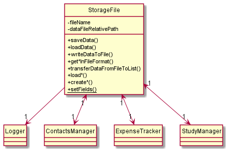

Note: Exception classes are left out of this diagram that aims to show the core structure of the load-save functionality.
TextUi class is also left out since it is used once for printing an error message. 
Some methods and attributes are not mentioned to keep the diagram simple while keeping the core information visible. 

As seen from the class diagram above (which shows the portions relevant to the `StorageFile` class), 
the `StorageFile` class associates to a `Logger` class, a `ContactsManager` class, an `ExpenseTracker` class
and a `StudyManager` class. The `AllOnUs` class (to do with main menu) associates to a `StorageFile` class (not shown in class diagram) 
and the manager and tracker classes associate to the `StorageFile` class as well.

The `StorageFile` class has private attributes `fileName` and `dataFileRelativePath` which define the name of the file
and the relative path of the file to project directory, which are utilized in creating/locating the file by the 
`StorageFile` class. More details on this will be discussed soon. 

All the methods in this class are public and the
only static method `setFields()` is utilized by class `AllOnUs` to initialize the `StorageFile` class with instances of
the `ContactsManager`, `ExpenseTracker` and `StudyManager` classes (used in the application) and the file related attributes.

`get*InFileFormat()`, `load*()` and `create*()` methods represent multiple methods that adhere to the respective forms
and will be discussed further as needed. 

We first talk about the save functionality. 

#### Save

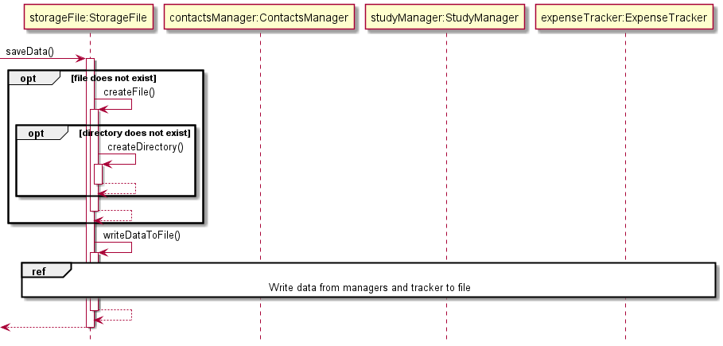
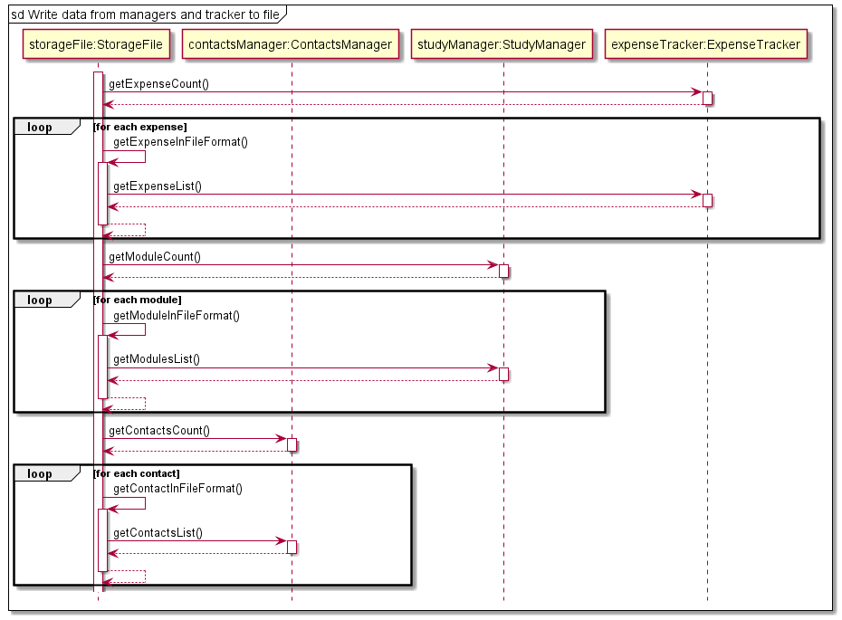

Upon any modification to the lists maintained by the manager or tracker objects, a boolean `isModified` is changed to 
`true` (initially `false` at the start of every iteration of interaction with the user) and this triggers a call to 
the `saveData()` method of the `StorageFile` class. If the file for saving does not exist, it is created. While creating 
the file, if it is discovered the directory does not exist either, it is created first. These are done through calls to 
`createFile()` and `createDirectory()`. 

The total number of expense items maintained by the expense tracker is then obtained through a call to `getExpenseCount()`
which is a method of the `ExpenseTracker` class. For each of these items, we get a file representation of this expense item
through a call to `getExpenseInFileFormat()`, which obtains the specific expense item through a call to `getExpenseList()`
and this item is converted into file format. The expense item entry is then written to the file in `append` mode and is
now considered "saved". These steps are repeated for module items managed by study manager and contact items managed 
by contacts manager. 

After all entries have been saved, control returns to where the `saveData()` method was called from so that interaction
with the user can resume. 

#### Load

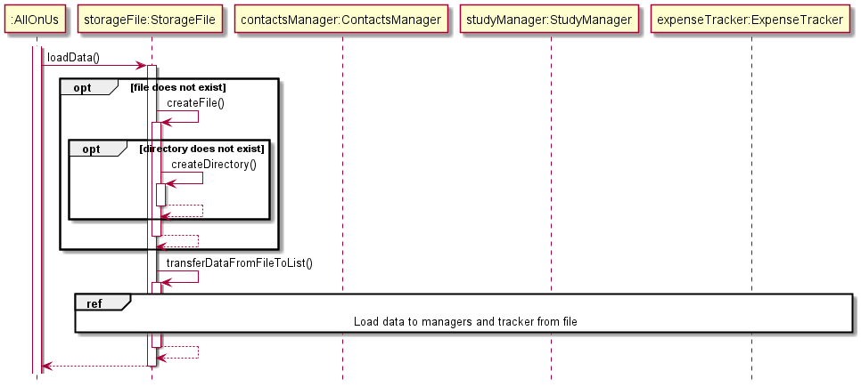
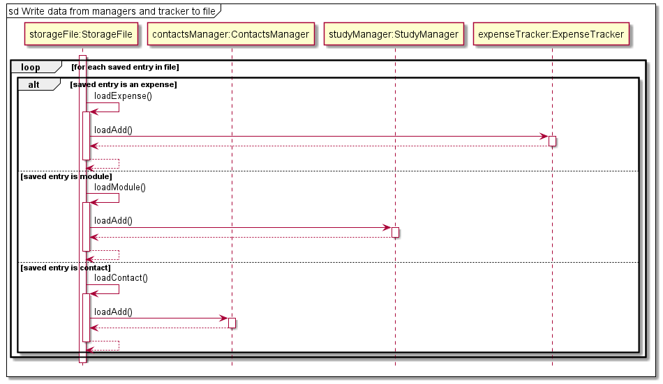

This feature is only executed at the start of the application when we need to load the data stored on a file into our
application. The `loadData()` method of `StorageFile` class is called by the `run()` method of AllOnUs class before
entering the user interaction loop of the main menu. There is then a self-invocation of `transferDataFromFileToList()`,
which opens the file to be loaded from before reading data from it. In the event the file does not exist, an exception 
`FileNotFoundException` is raised which is caught by the `loadData()` method and the file creation process described 
earlier occurs before a call to `transferDataFromFileToList()` again. In the sequence diagram above, this mechanism
is described using "opt" to simplify the diagram but the outcome is equivalent to what is actually happening. 

Once `transferDataFromFileToList()` is called (assuming the file is created by now, or the process above would repeat),
each entry in the file is read and using a simple "if-else" clause we can determine whether the entry is an expense,
a module or a contact (format of saved entry is specific to entry type). If it is an expense, `loadExpense()` is called
which then calls `loadAdd()` belonging to the `ExpenseTracker` instance representing the expense tracker of the application.
`loadAdd()` then calls the local method used for addition of expense entries into the locally maintained list.
Here, we can see that the loading mechanism essentially relies on the underlying (already existing) item addition mechanisms
that the manager and tracker classes possess to load entries correctly.
Similar operations occur for entries of type module and contact. 

Once all the entries have been loaded and there are no more lines to be read, the loop breaks and control returns to 
the `run()` method of `:AllOnUs`, so that interactions with the user can begin. 

## Glossary

| Terms     | Definition                                                                                                                                                            |
|-----------|-----------------------------------------------------------------------------------------------------------------------------------------------------------------------|
| Main Menu | The Main Menu the user interfaces with to access the 3 components: `ContactsManager`, `ExpenseTracker` and `StudyManager`                                             |
| Contacts  | The Contacts component which manages a list of contacts added by the user. It facilitates the adding, deleting, editing and finding of contacts as well.              |
| Expense   | The Expense component which manages a list of expense records added by the user. It facilitates the adding, deleting, editing and finding of expense records as well. |
| Modules   | The Modules component which manages a list of expense records added by the user. It facilitates the adding, deleting, editing and finding of classes as well.         |
| Storage   | The Storage class responsible for the saving to and loading from the save file respectively.                                                                          |
| TextUi    | The TextUi class deals with all things related to printing and reading of lines for the user to interface with.                                                       |
| Parser    | Each component has their own respective parser, which makes sense of the user's input before executing them.                                                          |

## Instructions for manual testing

Given below are instructions to test the app manually:

> :information_source: **Note:** These instructions only provide a starting point for testers to work on; testers are
> expected to do more *exploratory* testing.

### Launch and Shutdown 
1. Initial launch 
   1. Download the jar file and copy into an empty directory.
   2. Using command line, navigate to the above directory and execute the jar file.
   
2. Shutdown
   1. Navigate to menu using `menu` command.
   2. enter `exit` to appropriately terminate the application. 

### Study Manager

1. Deleting a module while all modules are shown.
   1. Prerequisites: List all modules using the `list` command. Ensure there are multiple modules in the list.
   2. Test case: `rm 1`
      1. Expected: First module is deleted from the list. Details of the deleted module shown in status message.
   3. Test case: `rm 0`
      1. Expected: No module is deleted from the list. Error details shown in the status message.
   4. Other incorrect delete commands to try: `rm`, `rm 100000` 
      1. Expected: Error message similar to step 3.

2. Adding a module to the list.
   1. Requires module code, category, day and time.
   2. Test case: `add m/CS2113 c/lec d/Thursday t/2:00 pm-4:00 pm`
      1. Expected: Module is added to the list and details are shown on the console.
   3. Test case: `add m/CS2113`
      1. Expected: No module is added to the list. Error details are shown on console.
   4. Other incorrect add commands to try: `add`, `add c/lec t/4pm-6pm`
      1. Or any commands that exclude one of the four requirements to add module.
      2. Expected: Error message similar to above.
      
### Expense Tracker
1. Adding a new expense record to the list
   1. Requires date, amount, category and remarks in proper format
   2. Test case: `add d/2022-03-24 a/9.50 c/Movie r/Jujutsu Kaisen`
      1. Expected: Expense record is added to the list and details are shown on the console.
   3. Test case: `add d/Invalid Date Field a/9.50 c/Movie r/Jujutsu Kaisen`
      1. Expected: Expense record not added due to invalid date format. 
      Error details are shown on console.
   4. Test case: `add d/2022-03-24 a/Invalid Amount Field c/Movie r/Jujutsu Kaisen`
      1. Expected: Expense record not added due to invalid amount format. 
      Error details are shown on console.
   5. Test case: `add d/ a/ c/ r/`
      1. Expected: Expense record not added due to missing values. 
      Error details are shown on console.
   6. Test case: `add m/`
      1. Expected: Expense record not added due to missing fields.
      Error details are shown on console.
   7. Test case: `add d/2022-03-24 a/500 c/Car r/Slash /in middle`
      1. Expected: Expense record not added due to slash in invalid position.
      Error details are shown on console.
      
2. Deleting an expense record after listing
   1. Prerequisites: List all expense records using the `list` command. Multiple records exist in the list.
   2. Test case: `rm 1`
      1. Expected: First expense record is deleted from the list. Details of the deleted record shown in
      status message.
   3. Test case: `rm 0`
      1. Expected: No module is deleted from the list. Error details shown on console.
   4. Other incorrect delete commands: `rm`
      1. Expected: Error message similar to step 3.
      
3. Editing an existing expense record
   1. Prerequisites: Expense record exists in the list.
   2. Test case: `edit 1`
      1. Expected: Retrieves first expense record and asks user for field to edit.
   3. Test case: `edit 0`
      1. Expected: No expense record is retrieved to be edited. Error details shown on console.
   4. Test case:  `edit 1`  `INVALIDFIELD randomvalue`
      1. Expected: Retrieves first expense record, but does not edit any field due to unknown
      field parameter. Error details shown on console.
      
4. Finding a specific expense record
   1. Prerequisite: Expense record exists in the list and contains the word "test".
   2. Test case: `find test`
      1. Expected: Retrieves expense record which contains the word "test"
   3. Test case: `find notest`
      1. Expected: No expense record retrieved as keyword is not found in any record.
   4. Test case: `find`
      1. Expected: No expense record retrieved as keyword not specified. Error details shown on console.
      2. Expected: Error messge similar to above.

### Contacts Manager
1. Adding a new contact
   1. Test case: `add n/Name1 f/Faculty e/email@u.nus.edu d/Description`  
   Expected: A contact with the above fields will be added to the list.
   Details of the added contact shown in the status message.
   New number of contacts in the list are also shown.
   2. Test case: `add e/email@u.nus.edu d/Description n/Name2 f/Faculty`  
   Expected: Similar to the previous.
   3. Test case: `add n/Name3 f/Faculty e/invalid email d/Description`  
   Expected: Similar to the previous, with reminder that the email may be invalid.
   4. Test case: `add n/Name1 f/Faculty e/email@u.nus.edu d/Description`  
   Expected: No contact is added. Error details shown in the status message,
   indicating that `Name1` is already in the list of contacts.
   5. Other incorrect delete commands to try: `add` (no fields), 
   `add n/` (invalid fields), `add f/fac d/desc` (missing fields), ...
   6. Note that any input between the `add` command and the first delimiter
   are ignored

2. Deleting a contact while all contacts are shown. 
   1. Prerequisites: Show all contacts using the `list` command. 
   Ensure that there are contacts in the list. 
   A message will be shown to indicate an empty list.
   2. Test case: `rm 1`  
   Expected: First contact is deleted from the list. 
   Details of the deleted contact shown in the status message. 
   Number of contacts left in the list are also shown. 
   3. Test case: `rm 0`  
   Expected: No contact is deleted. Error details shown in the status message. 
   4. Other incorrect delete commands to try: `rm`, `rm x` 
   (where x is negative or larger than the list size), 
   `rm not_a_number`, ...  
   Expected: Similar to previous.

[Back to main menu](https://ay2122s2-cs2113-f10-4.github.io/tp/)
