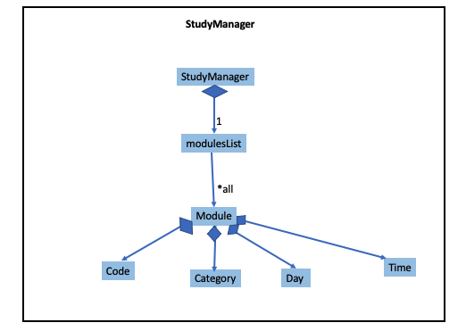

# Developer Guide

## Acknowledgements

{list here sources of all reused/adapted ideas, code, documentation, and third-party libraries -- include links to the original source as well}

## Design & implementation

{Describe the design and implementation of the product. Use UML diagrams and short code snippets where applicable.}

### Study Manager component
API: `StudyManager.java`

The `StudyManager` component,
1. Stores the academic schedule, i.e. all `Module` objects are contained in a `modulesList` object.
2. The storage can be bound to `modulesList` list such that everytime a change is observed in the list it is saved on to a file.
3. Does not depend on other components like `ExpenseTracker` and `ContactsManager`

## Product scope
### Target user profile

{Describe the target user profile}

### Value proposition

{Describe the value proposition: what problem does it solve?}

## User Stories

|Version| As a ... | I want to ... | So that I can ...|
|--------|----------|---------------|------------------|
|v1.0|new user|see usage instructions|refer to them when I forget how to use the application|
|v2.0|user|find a to-do item by name|locate a to-do without having to go through the entire list|

### Main Menu

### Modules

### Expenses

### Contacts

## Non-Functional Requirements

{Give non-functional requirements}

## Glossary

* *glossary item* - Definition

## Instructions for manual testing

### Launch and Shutdown 
1. Initial launch 
   1. Download the jar file and copy into an empty directory.
   2. Using command line, navigate to the above directory and execute the jar file.
   

### Study Manager
#### 
1. Deleting a module while all modules are shown.
   1. Prerequisites: List all modules using the `list` command. Ensure there are multiple modules in the list.
   2. Test case: `rm 1`
      1. Expected: First module is deleted from the list. Details of the deleted module shown in status message.
   3. Test case: `rm 0`
      1. Expected: No module is deleted from the list. Error details shown in the status message.
   4. Other incorrect delete commands to try: `rm`, `rm 100000` 
      1. Expected: Error message similar to step 3.
{Give instructions on how to do a manual product testing e.g., how to load sample data to be used for testing}

2. Adding a module to the list.
   1. Requires module code, category, day and time.
   2. Test case: `add m/CS2113 c/lec d/Thursday t/2pm-4pm`
      1. Expected: Module is added to the list and details are shown on the console.
   3. Test case: `add m/CS2113`
      1. Expected: No module is added to the list. Error details are shown on console.
   4. Other incorrect add commands to try: `add`, `add c/lec t/4pm-6pm`
      1. Or any commands that exclude one of the four requirements to add module.
      2. Expected: Error messge similar to above.