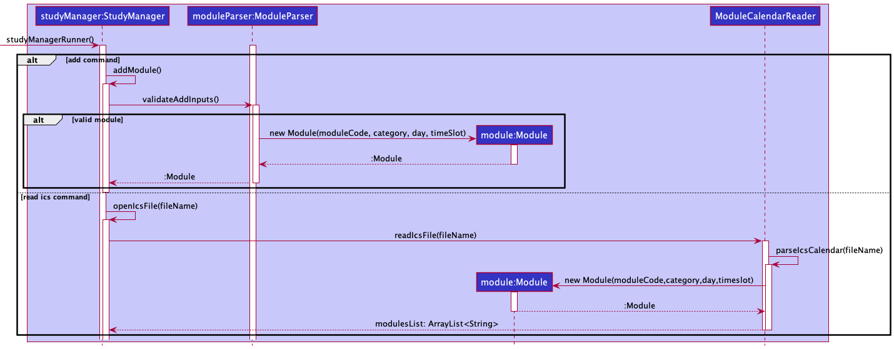
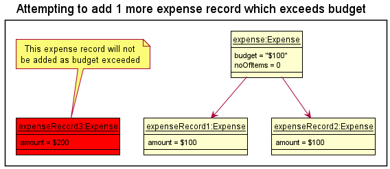
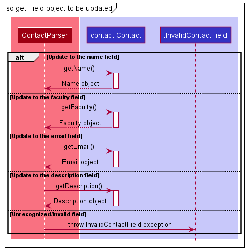

# Developer Guide

## Acknowledgements

* [AB-3 Developer Guide](https://se-education.org/addressbook-level3/DeveloperGuide.html)
* [PlantUML Tutorial at se-edu/guides](https://se-education.org/guides/tutorials/plantUml.html)
* [Our individual projects](AboutUs.md)

{list here sources of all reused/adapted ideas, code, documentation, and third-party libraries -- include links to the original source as well}

## Design & implementation

{Describe the design and implementation of the product. Use UML diagrams and short code snippets where applicable.}

## Product scope
### Target user profile
* has a need to manage their academic schedule 
* has a need to manage their expenses as a student
* has a need to manage a significant number of contacts
* prefer desktop apps over other types
* can type fast
* prefers typing to mouse interactions
* is reasonably comfortable using CLI apps

{Describe the target user profile}

### Value proposition

It solves the basic needs of a student such as managing academic schedule, expenses and contacts faster than a typical mouse driven or GUI driven apps.

## User Stories

|Version| As a ... | I want to ... | So that I can ...|
|--------|----------|---------------|------------------|
|v1.0|new user|see usage instructions|refer to them when I forget how to use the application|
|v1.0| user|add a new module|refer when I am not sure what is on my schedule right now|
|v1.0| user|list all modules|get a list of all my modules in one place|
|v1.0| user|delete a module|remove modules or tasks that I am done with|
|v1.0| user|add a new expense|keep track of my expenditure|
|v1.0| user|list all expenses|get a list of all my expenses in one place|
|v1.0| user|delete an expense|remove expenses that I do not need to track|
|v1.0| user|add a new contact|keep track of my contacts|
|v1.0| user|list all contacts|get a list of all my contacts in one place|
|v1.0| user|delete a contacts|remove contacts that I do not need to track|
|v2.0|user|find a module by name|locate a module without having to go through the entire list|
|v2.0|user|edit a module|change details for my existing modules to ensure consistency|
|v2.0|user|find an expense|locate an expense without having to go through the entire list|
|v2.0|user|edit an expense |change details for my existing expenses |
|v2.0|user|find a contact|locate a contact without having to go through the entire list|
|v2.0|user|edit a contact|change details for my existing contacts|
|v2.0|user|parse modules from NUSMods|easily add all my modules with a single command|
|v2.0|user|save and load entries from a session|reload my entries from the previous session|

### Main Menu
This section describes the implementation of core main menu features.

**API:** `AllOnUs.java`

The menu is accessed through a call to static method main() of the AllOnUs class. 
The Class Diagram below shows the overall structure of the application from the menu's point of view.
The AllOnUs class and other classes that are coupled to the menu are therefore included.

Note: Exception classes are left out of this diagram that aims to show the core structure of the application. is*Command()
method here refers to all methods of this form (more on this will be elaborated later in detail). 

As illustrated in the Class Diagram above, the AllOnUs class only associates to one of each of the other classes.
These classes are, namely, the ContactsManager class which manages the contacts section of the application, 
the StudyManager class which manages the module and timetable part of the application, the ExpenseTracker class
which manages the expenses section of the application, the Logger class which helps with logging information about the 
state of the programme when it is running and the TextUi class which handles user input from command line.

Now we will look at the sequence of operations that take place upon a call to method main() of the AllOnUs class. 
Below is a sequence diagram that shows the core interactions between associated classes and objects in the execution 
and runtime of the programme.

As illustrated in the diagram, once main() method of AllOnUs is called, a new unnamed :AllOnUs object is created 
for which we execute the non-static method run(), which contains a loop for sustained interaction with the user
(command line). Objects for the ContactsManager (contactsManager), StudyManager (studyManager) and ExpenseTracker (expenseTracker)
classes are also created, where Logger (logger) and TextUi (ui) objects are already contained in the fields of the 
:AllOnUs object. 

In the loop, run() method calls the getUserInput() method, which belongs to ui, and then checks the returned string for 
whether it is a command to enter a particular section, to get help, to exit the application or is an empty or unrecognizable 
command. 

Command to enter a particular section: 
The returned string from getUserInput() call becomes a parameter for a function call to static method is*Command(), which
belongs to the AllOnUs class, and the is*Command() method is of the form isStudyManagerCommand(), isContactsManagerCommand(),
isExpenseTrackerCommand(), which are called in a certain sequence. For instance, when isStudyManagerCommand() is called with
the string parameter and the string indeed contains a command to enter the study manager section, then the method returns true,
else false. If true is returned, we call the studyManagerRunner() method of the studyManager object. The studyManagerRunner() method
will carry out what it needs to and then eventually return to the run() method of the :AllOnUs object. If false is returned, we proceed 
to the next check on the string. This is also how the other commands and methods of the same form work. 

Command for help section:
If the isHelpCommand() method returns true on the string representing user input, the displayHelp() static method is called (in AllOnUs class)
which displays the help section to the user and then returns to the run() method of :AllOnUs object.

Empty of unrecognized command:
When the returned string is empty, we simply continue to the next iteration of the loop. This is essentially similar to a "pass" statement
as when the user does not input anything, the application silently waits for the user to input something into the command line. 
When there is an unrecognized command, the application prompts the user through a function call to a static method printInvalidMainMenuCommandMessage()
(belongs to AllOnUs class and not included in the diagrams above) to enter a known command and suggests referring to the help section.

Exit command:
If the isExitCommand() method returns true on the string representing user input, the loop breaks, and control is returned to the static main()
method of the AllOnUs class, which then calls the static exit method in the same class to print a termination message, and then finally control
is returned to the OS. 

### Study Manager component
API: `StudyManager.java`

The `StudyManager` component,
1. Stores the academic schedule, i.e. all `Module` objects are contained in a `modulesList` object.
2. The storage can be bound to `modulesList` list such that everytime a change is observed in the list it is saved on to a file.
3. Does not depend on other components like `ExpenseTracker` and `ContactsManager`

How the StudyManager works:
1. Based on a command entered by the user, StudyManager can perform the following functions 
   1. add 
   2. list
   3. delete
   4. edit
   5. find 
   6. read ics
2. There are two ways to add to the `moduleList` to keep track of academic schedule 
   1. Either the user can choose to add the modules one by one. (See user guide for add feature)
   2. Or the user can choose to read from NUSMods .ics calendar file of their academic schedule.  (See user guide for read from ics feature)
      1. This is more convenient as it can add multiple modules at a single go.
      2. This feature makes use of the `ModuleCalendarReader.java` API.
3. If there are any errors in the entry of `Module` parameters they are handled by the various exceptions in the `exceptions` package.

   
The two ways to add modules are illustrated in the sequence diagram below:

### Expense Component

How the Expense Tracker component works:
1. From the Main Menu, if the user decides to run `goto m/Expense_Tracker`, the `ExpenseTracker` class takes over.
2. The `expenseRunner` method begins by taking in user inputs depending on the user's requirements.
3. Depending on the user's input, the `ExpenseParser` class calls 
`parseXYZExpense` where `XYZ` is a placeholder for the specific command name (eg. `parseDeleteExpense`).
4. After parsing, the command is executed accordingly within the `ExpenseTracker` class.

#### [Proposed] Budgeting Reminder Feature

The proposed budgeting reminder feature is facilitated by `ExpenseTracker` and `Expense` class, which adds a 
private variable kept within the `Expense` class called `budget`. Additionally, it implements the following
operations:
- `Expense#setBudget(int)` --- Sets the current budget
- `Expense#getBudget()` --- Get the current budget left
- `ExpenseTracker#enable(int)` --- Turns on the budgeting mode which restricts exceeding of budget when adding new
expense records. It also sets the budget specified by the user.

Users may choose to enable the `Budgeting` feature via the command `enable` followed by the amount of budget
allocated in total. E.g `enable 3000`.

Whenever a new Expense record is added, the `addExpense` method of the `ExpenseTracker` class will check against
the current available `budget` and whether the expense record will cause the budget amount to be exceeded. If it 
exceeds, the addition of the new expense record will be rejected.

If the `enable` feature is turned on with existing records in the list, the `enable` method will run through the 
current list of expense records and deduct from the budget accordingly. If it already exceeds the budget, the user
will be forced to delete records until the budget is kept, or increase the budget accordingly.

Given below is an example usage scenario on how the Budgeting Reminder Feature works:

Step 1: The user navigates to the Expense Tracker for the first time, and decides to set a budget of $300.

Step 2: The user proceeds to add 2 expense records, each with an amount of $100.

Step 3: The user now tries to add 1 more expense record with an amount of $200. This exceeds the budget and hence the 
addition will not be processed.

The following sequence diagram shows how the budget is checked upon every new addition of expense records:

### Contacts

#### Contacts Manager Component

**API:** `ContactsManager.java`

The `ContactsManager` component:
* stores the Contacts Manager data, i.e. all `Contact` objects are
contained in the contacts list, stored as a private class variable 
within a `ContactsManager` instance.
* each `Contact` object has four fields, `Name`, `Faculty`, `Email`,
and `Description`. These four classes inherit from the abstract class `Field`.
* calls methods in the `ContactParser` class to parse user inputs and
make the relevant edits to the contacts list

#### Contact Parser Component
**API:** `ContactParser.java`

The Sequence Diagram below illustrates interactions between classes of objects
for the static `setContactFields(contact, fieldStrings)` API call.

For each string in the array `fieldStrings`, the method identifies
which contact field the string corresponds to, get a reference to the
Field object from `contact`, and then uses the polymorphic `setField()`
call to update the value of the corresponding field of `contact`.

### Load and Store
Coming soon.

## Non-Functional Requirements

{Give non-functional requirements}

## Glossary

* *glossary item* - Definition

## Instructions for manual testing

### Launch and Shutdown 
1. Initial launch 
   1. Download the jar file and copy into an empty directory.
   2. Using command line, navigate to the above directory and execute the jar file.
   

### Study Manager
#### 
1. Deleting a module while all modules are shown.
   1. Prerequisites: List all modules using the `list` command. Ensure there are multiple modules in the list.
   2. Test case: `rm 1`
      1. Expected: First module is deleted from the list. Details of the deleted module shown in status message.
   3. Test case: `rm 0`
      1. Expected: No module is deleted from the list. Error details shown in the status message.
   4. Other incorrect delete commands to try: `rm`, `rm 100000` 
      1. Expected: Error message similar to step 3.
{Give instructions on how to do a manual product testing e.g., how to load sample data to be used for testing}

2. Adding a module to the list.
   1. Requires module code, category, day and time.
   2. Test case: `add m/CS2113 c/lec d/Thursday t/2pm-4pm`
      1. Expected: Module is added to the list and details are shown on the console.
   3. Test case: `add m/CS2113`
      1. Expected: No module is added to the list. Error details are shown on console.
   4. Other incorrect add commands to try: `add`, `add c/lec t/4pm-6pm`
      1. Or any commands that exclude one of the four requirements to add module.
      2. Expected: Error messge similar to above.